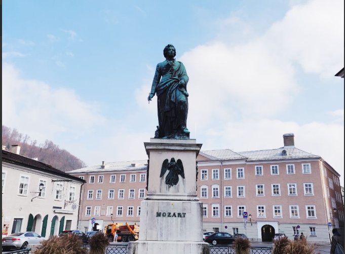

Beberapa hari yang lalu gw berkesempatan untuk mengunjungi Salzburg, kota kelahiran Mozart (yes the famous composer **Wolfgang Amadeus Mozart**). Everywhere in the city you’ll find anything Mozart, mulai dari kafe, monumen, museum, dan berbagai merchandise.

*What’s so special about him?* Selain karena dia merupakah salah satu komposer terkenal, dia juga mulai menulis lagu saat masih sangat muda. When he was a teenager, he had been playing in various concerts and creating his own musical masterpieces. Di umur yang sama, I was struggling to learn those pieces! Sungguh beda nasib, hahaha 😀

But it’s okay. Di saat yang sama gw juga selesai baca buku berjudul [“Range“](https://www.goodreads.com/book/show/41795733-range). Si penulis menjelaskan bahwa setiap orang punya path dan pace nya masing-masing. Tidak mesti punya timeline persis Mozart untuk sukses. *Headstart* memang berharga tapi tidak ada kata terlambat untuk memulai (I know it sounds so vague but you should read the book to understand why!).

People around are gonna keep reminding us about the artificial life deadlines. Gw rasa ini sangat akut terutama di Asia, umur sekian udah harus mapan, umur sekian udah harus nikah dan punya anak, dsb. But I’ve seen too many people who were considered “late” became more successful than many of those who were “on time”. Gw pun percaya bahwa tiap orang punya timing nya masing-masing, and I stop concerning over what other people might say.